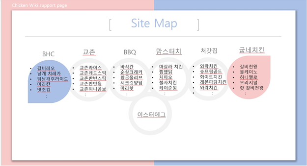

# Chicken WIKI
> 2019 - 1학기 Web Programming Team-Project

## 주제 선정 이유
  * 가장 많이 먹는 음식 중 하나인 치킨에 대한 자세한 설명이 있는 사이트의 부재

## 예상 이용자
  * 치킨을 먹고 싶으나 어떤 치킨을 먹을지 고민하는 사람
  * 지금 먹고 있는 치킨의 정보를 자세하게 알고 싶은 사람

## 서비스 목록
  1. BHC
  2. 교촌치킨
  3. BBQ 치킨
  4. 맘스터치
  5. 처갓집
  6. 굽네치킨

## 기능
  * 인기 메뉴 순위 ( 자동 X )
  * 치킨 검색 기능
  * 브랜드 치킨 나열 ( 표 )
  * Easter EGG

## Image
  
  
  
  
  
  